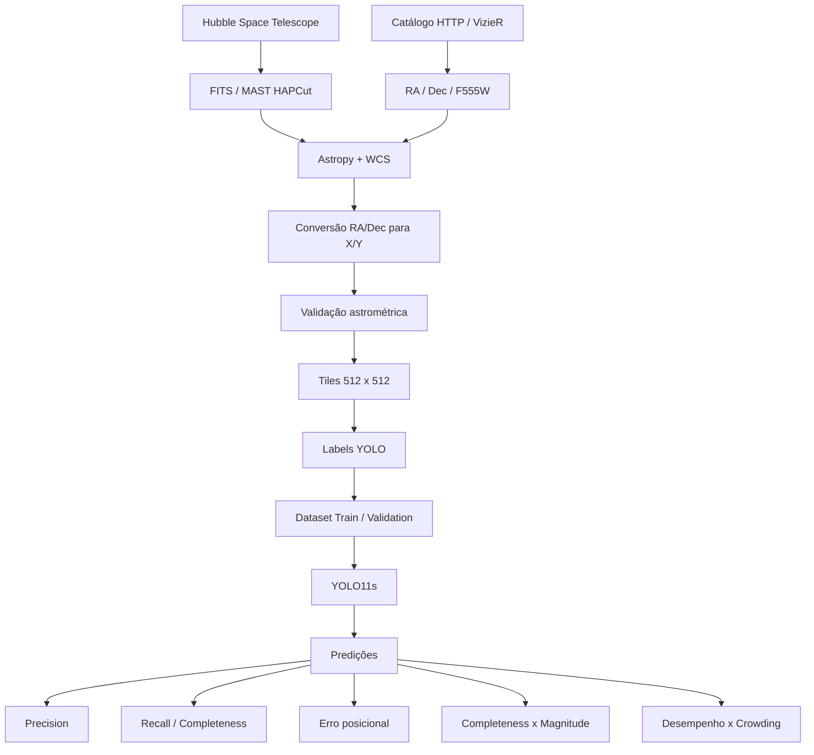

# Deep Learning Detection of Stellar Sources in Crowded Fields
## A YOLO Study of 30 Doradus

Este projeto investiga o uso de **Deep Learning e visão computacional para detecção de fontes estelares em campos densamente povoados**, utilizando como estudo de caso a **Nebulosa da Tarântula (30 Doradus)** e, em especial, a região do aglomerado estelar **R136**.

O experimento utiliza imagens científicas reais do **Hubble Space Telescope (HST)**, dados em formato **FITS**, informações astrométricas via **WCS (World Coordinate System)** e o catálogo fotométrico do **Hubble Tarantula Treasury Project (HTTP)**. As posições astronômicas das fontes catalogadas são convertidas para coordenadas de pixel e utilizadas para gerar automaticamente um dataset no formato esperado pelo YOLO.

O objetivo não é substituir técnicas consolidadas de fotometria estelar, mas investigar **até que ponto um detector de objetos baseado em Deep Learning consegue localizar fontes estelares em regiões de alta densidade**, quais são seus limites e como seu desempenho muda com magnitude, densidade estelar e sobreposição de fontes.

> **Status:** experimento científico e educacional em desenvolvimento. Os valores numéricos de desempenho devem ser obtidos pela execução do notebook e não são assumidos previamente neste README.

---

## 1. Motivação

Detectar estrelas em uma imagem astronômica parece, à primeira vista, um problema simples de visão computacional. Em campos densos, entretanto, várias dificuldades aparecem simultaneamente:

- estrelas podem ocupar poucos pixels;
- estrelas fracas podem estar próximas de estrelas muito brilhantes;
- as PSFs (*Point Spread Functions*) podem se sobrepor;
- gás e nebulosidade alteram o background;
- fontes muito próximas podem ser interpretadas como uma única detecção;
- algoritmos de *Non-Maximum Suppression* podem eliminar fontes reais vizinhas;
- o limite de detecção depende da magnitude e da qualidade da imagem.

R136 fornece um caso particularmente interessante porque apresenta uma concentração extrema de estrelas jovens e massivas dentro de 30 Doradus.

A pergunta central do projeto é:

> **Até que ponto um detector YOLO consegue identificar fontes estelares individuais em regiões congestionadas de 30 Doradus e como seu desempenho varia com magnitude e crowding?**

---

## 2. Objeto astronômico

A **Nebulosa da Tarântula**, também conhecida como **30 Doradus**, é uma grande região de formação estelar localizada na **Grande Nuvem de Magalhães (LMC)**.

O Hubble Tarantula Treasury Project (HTTP) foi criado para estudar as populações estelares de 30 Doradus em diferentes comprimentos de onda. O catálogo fotométrico HTTP contém mais de 800 mil fontes medidas a partir de observações HST.

Neste experimento, o primeiro campo analisado é centrado em **R136**, núcleo extremamente denso do aglomerado NGC 2070.

Coordenadas utilizadas no notebook:

```text
RA  = 05h 38m 42.39s
Dec = -69° 06' 02.81"
```

---

## 3. Objetivos

O projeto possui cinco objetivos principais.

1. Construir automaticamente um dataset de detecção a partir de **dados astronômicos reais**.
2. Treinar um modelo **YOLO11** para identificar fontes estelares.
3. Medir o desempenho do detector em um campo densamente povoado.
4. Avaliar o impacto de **magnitude estelar** e **crowding** sobre a detecção.
5. Criar uma base para comparação com métodos astronômicos tradicionais, como **DAOStarFinder** e técnicas de **PSF fitting**.

---

## 4. Pipeline do experimento



---

## 5. Fontes dos dados

### Hubble Tarantula Treasury Project — HTTP

O **Hubble Tarantula Treasury Project** é a principal fonte científica utilizada neste trabalho.

O levantamento contém observações de 30 Doradus em múltiplos filtros do HST:

| Região espectral | Filtros |
|---|---|
| Ultravioleta próximo | F275W, F336W |
| Óptico | F555W, F658N, F775W |
| Infravermelho próximo | F110W, F160W |

Página oficial do projeto:

https://archive.stsci.edu/hlsp/http

DOI do conjunto de dados HTTP:

```text
10.17909/T9RP4V
```

### Catálogo fotométrico HTTP

O catálogo utilizado como referência (*ground truth*) é:

```text
VizieR: J/ApJS/222/11
```

Página:

https://cdsarc.cds.unistra.fr/viz-bin/cat/J/ApJS/222/11

Artigo de referência:

> Sabbi, E. et al. (2016). *Hubble Tarantula Treasury Project. III. Photometric Catalog and Resulting Constraints on the Progression of Star Formation in the 30 Doradus Region*. The Astrophysical Journal Supplement Series, 222, 11.

DOI:

```text
10.3847/0067-0049/222/1/11
```

---

## 6. Entrada do pipeline

O experimento utiliza duas entradas científicas principais.

### 6.1 Imagem FITS

A imagem é obtida do arquivo MAST por meio do serviço **HAPCut**, evitando inicialmente o download dos mosaicos completos do HTTP.

Entrada:

```text
HST FITS cutout
```

Informações utilizadas:

```text
imagem científica
header FITS
WCS
filtro
instrumento
resolução espacial
```

A primeira região é centrada em R136.

### 6.2 Catálogo fotométrico

O catálogo fornece as coordenadas e propriedades das fontes conhecidas.

Campos principais:

| Campo | Uso |
|---|---|
| `HTTP` | identificador da fonte |
| `RAdeg` | ascensão reta |
| `DEdeg` | declinação |
| `F555mag` | magnitude na banda F555W |
| `e_F555mag` | incerteza fotométrica |
| `q_F555mag` | indicador de qualidade |
| `f_F555mag` | flag de qualidade/classificação |

No baseline, são priorizadas fontes com:

```python
f_F555mag == 1
```

e um limite inicial de magnitude:

```python
F555mag <= 25.5
```

Esse limite é um parâmetro experimental e deve ser alterado em estudos posteriores.

---

## 7. Conversão astrométrica

As posições das estrelas no catálogo são fornecidas como coordenadas celestes:

```text
RA / Dec
```

O `Astropy` e o WCS do FITS são utilizados para converter essas posições em coordenadas da imagem:

```text
RA / Dec
    ↓
   WCS
    ↓
X / Y em pixels
```

Essa etapa permite relacionar cada estrela catalogada a uma posição específica na imagem Hubble.

Antes da criação do dataset, o notebook apresenta uma visualização com as estrelas catalogadas sobrepostas ao FITS.

Essa validação é importante porque qualquer deslocamento astrométrico entre a imagem e o catálogo produzirá labels incorretos.

---

## 8. Preparação da imagem

Imagens FITS possuem uma faixa dinâmica muito maior do que imagens convencionais de 8 bits.

Para produzir as imagens utilizadas pelo detector, o notebook aplica:

```text
FITS
 ↓
remoção/tratamento de NaN
 ↓
Percentile Interval
 ↓
Asinh Stretch
 ↓
normalização
 ↓
imagem 8-bit
```

O *stretch* permite tornar simultaneamente visíveis estrelas fracas e estruturas brilhantes sem alterar as coordenadas das fontes.

> O PNG usado pelo YOLO é uma representação para visão computacional. O FITS original continua sendo a referência científica.

---

## 9. Divisão em tiles

Em vez de reduzir uma imagem HST inteira para a resolução típica de uma rede de detecção, o campo é dividido em regiões menores.

Baseline:

```text
512 × 512 pixels
```

Cada tile mantém a escala espacial do recorte original.

Isso é importante porque estrelas fracas podem ocupar poucos pixels. Uma redução excessiva da imagem poderia fazer com que essas fontes praticamente desaparecessem.

---

## 10. Geração automática de labels YOLO

Para cada estrela catalogada dentro de um tile é criada uma pequena *bounding box* centrada em sua coordenada.

Formato YOLO:

```text
class_id x_center y_center width height
```

Os valores são normalizados entre `0` e `1`.

Classe utilizada:

```text
0 = star
```

O baseline utiliza uma caixa fixa de aproximadamente:

```text
10 × 10 pixels
```

Esse tamanho é apenas uma aproximação inicial.

Uma evolução natural do projeto é calcular o tamanho das caixas a partir da **PSF/FWHM** real da imagem.

---

## 11. Estrutura esperada do dataset

Após a preparação, o diretório de trabalho assume aproximadamente a seguinte estrutura:

```text
tarantula_yolo/
│
├── data.yaml
├── r136_hubble_cutout.fits
│
├── images/
│   ├── train/
│   │   ├── r136_001.png
│   │   ├── r136_002.png
│   │   └── ...
│   │
│   └── val/
│       ├── r136_010.png
│       └── ...
│
├── labels/
│   ├── train/
│   │   ├── r136_001.txt
│   │   └── ...
│   │
│   └── val/
│       └── ...
│
└── metadata/
    ├── train/
    │   ├── r136_001.csv
    │   └── ...
    │
    └── val/
        └── ...
```

Os arquivos CSV preservam informações científicas das estrelas presentes em cada tile, incluindo magnitude e coordenadas.

---

## 12. Modelo

O baseline utiliza:

```text
Ultralytics YOLO11s
```

O modelo é inicializado a partir de pesos pré-treinados:

```python
from ultralytics import YOLO

model = YOLO("yolo11s.pt")
```

A tarefa possui somente uma classe:

```text
star
```

O modelo é treinado para aprender a localizar fontes estelares a partir dos labels derivados do catálogo HTTP.

Documentação do YOLO11:

https://docs.ultralytics.com/models/yolo11/

---

## 13. Configuração inicial de treinamento

Configuração de referência do notebook:

```python
model.train(
    data="data.yaml",
    epochs=30,
    imgsz=512,
    batch=4,
    max_det=5000,
    mosaic=0.0,
    mixup=0.0,
    hsv_h=0.0,
    hsv_s=0.0,
    hsv_v=0.0
)
```

Algumas técnicas comuns de *augmentation* são desativadas deliberadamente.

Transformações agressivas de cor podem não ter significado físico para uma imagem astronômica monocromática, e `mosaic` ou `mixup` podem produzir distribuições artificiais de estrelas.

Flips horizontais e verticais podem ser utilizados porque não alteram a natureza do problema de detecção.

---

## 14. Crowding e Non-Maximum Suppression

Em imagens convencionais, o YOLO usa *Non-Maximum Suppression* para remover caixas consideradas duplicadas.

Em regiões como R136 isso representa um desafio.

Duas estrelas fisicamente distintas podem estar separadas por poucos pixels:

```text
      * *
```

e suas caixas podem apresentar forte sobreposição.

O detector pode interpretar uma delas como duplicata da outra.

Por esse motivo, o baseline utiliza na inferência:

```python
iou=0.80
max_det=5000
```

Esses valores não devem ser considerados definitivos. Eles fazem parte dos hiperparâmetros a serem estudados.

---

## 15. Métricas

O projeto não utiliza somente `mAP`.

Para astronomia, interessa saber se a posição prevista corresponde a uma fonte real catalogada.

### Precision

Responde:

> Das fontes detectadas pelo modelo, quantas correspondem a estrelas do catálogo?

```text
Precision = TP / (TP + FP)
```

### Recall / Completeness

Responde:

> Das estrelas existentes no catálogo, quantas foram recuperadas pelo modelo?

```text
Completeness = TP / (TP + FN)
```

Neste projeto, `Recall` e `Completeness` são usados no contexto da recuperação das fontes do catálogo selecionado.

### Erro posicional

Distância entre o centro previsto pelo YOLO e a posição da estrela catalogada:

```text
predição (x,y)
      ↓
distância em pixels
      ↓
posição HTTP (x,y)
```

O baseline utiliza um raio de associação de:

```text
5 pixels
```

### Completeness × magnitude

Uma das análises científicas mais relevantes será medir:

```text
magnitude ↑
    ↓
estrela mais fraca
    ↓
completeness ?
```

O objetivo é determinar como a eficiência do detector diminui para fontes progressivamente mais fracas.

### Desempenho × crowding

Outra análise central:

```text
densidade estelar ↑
        ↓
sobreposição de PSFs ↑
        ↓
recall / completeness ?
```

Esse teste ajuda a identificar o ponto em que o campo se torna difícil demais para o detector.

---

## 16. Resultados esperados

Os resultados abaixo são **hipóteses e produtos esperados do experimento**, não valores previamente obtidos.

| Resultado | Expectativa |
|---|---|
| Detecção de estrelas brilhantes e isoladas | maior facilidade de detecção |
| Estrelas progressivamente mais fracas | tendência de redução da completeness |
| Campos pouco densos | maior separação entre fontes |
| Regiões altamente densas | maior dificuldade devido a blending e NMS |
| Região de R136 | cenário de stress test |
| Erro posicional | possibilidade de medir a precisão do centro previsto |
| Curva magnitude × completeness | caracterização do limite prático do detector |
| Curva crowding × recall | caracterização do efeito da densidade estelar |

O projeto deve produzir, entre outros resultados:

```text
imagem + ground truth
imagem + detecções YOLO
precision
recall / completeness
F1
erro posicional mediano
erro posicional P90
completeness × F555W
recall × densidade estelar
```

O interesse científico não está apenas em obter um valor alto de mAP, mas em entender **onde e por que o detector começa a falhar**.

---

## 17. Notebook

Notebook principal:

```text
tarantula_yolo_r136_colab.ipynb
```

Ele foi preparado para execução no **Google Colab**.

Fluxo principal:

```text
instalação das dependências
        ↓
download do FITS
        ↓
consulta ao VizieR
        ↓
conversão WCS
        ↓
validação visual
        ↓
geração dos tiles
        ↓
labels YOLO
        ↓
treinamento
        ↓
inferência
        ↓
avaliação científica
```

---

## 18. Dependências

Principais bibliotecas:

```text
Python 3
NumPy
Pandas
Matplotlib
Pillow
Astropy
Astroquery
Photutils
SciPy
PyYAML
Ultralytics
```

Instalação no Colab:

```bash
pip install astroquery astropy photutils ultralytics scipy pyyaml
```

---

## 19. Executando no Google Colab

Abra o notebook:

```text
tarantula_yolo_r136_colab.ipynb
```

Para utilizar GPU:

```text
Ambiente de execução
    ↓
Alterar tipo de ambiente de execução
    ↓
GPU
```

Execute as células sequencialmente.

O notebook consulta serviços externos do **MAST** e **VizieR**, portanto necessita de acesso à internet.

---

## 20. Parâmetros experimentais

Os principais parâmetros estão concentrados no início do notebook.

Exemplo:

```python
CUTOUT_SIZE = 120 * u.arcsec

TILE_SIZE = 512

VAL_FRACTION = 0.20

MAG_LIMIT = 25.5

BOX_SIZE_PX = 10.0

MATCH_RADIUS_PX = 5.0
```

Esses valores foram definidos como baseline e devem ser tratados como variáveis experimentais.

---

## 21. Experimentos planejados

### Experimento A — limite de magnitude

Repetir o treinamento e a avaliação utilizando:

```text
F555W < 23
F555W < 24
F555W < 25
F555W < 26
F555W < 27
```

Objetivo:

```text
magnitude → completeness
```

### Experimento B — densidade estelar

Selecionar três regimes dentro de 30 Doradus:

```text
baixa densidade
       ↓
densidade intermediária
       ↓
R136
```

Objetivo:

```text
crowding → recall
```

### Experimento C — comparação com métodos tradicionais

Comparar:

```text
                 HTTP Catalog
                      │
          ┌───────────┼───────────┐
          │           │           │
          ▼           ▼           ▼
       YOLO11   DAOStarFinder   PSF fitting
          │           │           │
          └───────────┼───────────┘
                      ▼
             Precision / Recall
             erro posicional
             limite de magnitude
             crowding
```

### Experimento D — múltiplas bandas

Uma evolução posterior poderá combinar diferentes filtros:

```text
F336W
F555W
F775W
   ↓
modelo multibanda
```

Isso permitiria investigar se informação fotométrica adicional ajuda o detector a distinguir fontes estelares do background nebular.

---

## 22. Limitações

### YOLO não é um algoritmo fotométrico

O objetivo do YOLO é detectar objetos. Ele não realiza automaticamente fotometria científica nem substitui técnicas de ajuste de PSF.

### Bounding boxes são uma simplificação

Uma estrela é melhor descrita por uma **Point Spread Function** do que por uma caixa retangular.

### Catálogo não significa verdade absoluta

O catálogo HTTP é uma referência científica de alta qualidade, mas possui seus próprios limites de detecção, critérios de qualidade e incompletude.

### Label noise

Uma estrela fora do limite de magnitude escolhido pode permanecer visível na imagem, mas não aparecer como label de treinamento.

Isso pode fazer com que uma fonte real seja considerada falso positivo pelo pipeline.

### Diferenças astrométricas

Produtos HST processados por pipelines diferentes podem apresentar pequenos offsets.

A sobreposição entre catálogo e imagem deve ser verificada antes do treinamento.

### NMS

Fontes muito próximas podem ser eliminadas pela etapa de supressão de detecções sobrepostas.

Esse efeito é especialmente relevante em R136.

---

## 23. Interpretação científica

Um modelo visualmente convincente não é necessariamente um detector cientificamente confiável.

Por isso, este projeto procura responder perguntas mensuráveis:

```text
Qual é a completeness?

Até qual magnitude?

Com qual erro posicional?

Em qual densidade estelar?

Quantas detecções são falsas?

Como o modelo se compara a métodos astronômicos tradicionais?
```

A avaliação deve sempre considerar essas condições antes de qualquer conclusão sobre a utilidade do modelo para astronomia.

---

## 24. Reprodutibilidade

Para facilitar a reprodução dos experimentos, recomenda-se registrar:

```text
seed aleatória
versão das bibliotecas
modelo YOLO utilizado
pesos iniciais
limite de magnitude
filtro HST
coordenadas do cutout
tamanho do cutout
tamanho do tile
tamanho das bounding boxes
confidence threshold
IoU / NMS
match radius
divisão train/validation/test
```

O baseline utiliza:

```python
SEED = 42
```

---

## 25. Próxima etapa científica

O passo seguinte recomendado é transformar o baseline em um benchmark entre:

```text
YOLO11
vs.
DAOStarFinder
vs.
PSF fitting
```

utilizando exatamente os mesmos campos e a mesma seleção de fontes do catálogo HTTP.

A análise deve ser realizada separadamente para regiões de baixa, média e alta densidade estelar.

Isso permitirá investigar de forma mais rigorosa:

> **Em quais condições um detector baseado em Deep Learning pode complementar técnicas clássicas de detecção de fontes estelares?**

---

## 26. Referências

### Hubble Tarantula Treasury Project

Space Telescope Science Institute — MAST.

https://archive.stsci.edu/hlsp/http

DOI:

```text
10.17909/T9RP4V
```

### Catálogo HTTP

Sabbi, E. et al. (2016).

**Hubble Tarantula Treasury Project. III. Photometric Catalog and Resulting Constraints on the Progression of Star Formation in the 30 Doradus Region.**

*The Astrophysical Journal Supplement Series*, 222, 11.

DOI:

```text
10.3847/0067-0049/222/1/11
```

VizieR:

https://cdsarc.cds.unistra.fr/viz-bin/cat/J/ApJS/222/11

### Astroquery / MAST HAPCut

https://astroquery.readthedocs.io/en/stable/mast/mast_cut.html

### Astropy

https://www.astropy.org/

### Photutils

https://photutils.readthedocs.io/

### Ultralytics YOLO11

https://docs.ultralytics.com/models/yolo11/

---

## 27. Uso dos dados e créditos

As imagens e os catálogos astronômicos utilizados no projeto são provenientes de bases científicas públicas mantidas pelo **Space Telescope Science Institute (STScI/MAST)** e pelo **Centre de Données astronomiques de Strasbourg (CDS/VizieR)**.

Ao utilizar ou publicar resultados derivados do Hubble Tarantula Treasury Project, consulte as instruções de citação e reconhecimento indicadas pelo próprio projeto e pelo catálogo VizieR.

Os dados científicos originais permanecem sujeitos aos termos e políticas de seus respectivos provedores.

O código e os notebooks deste repositório não alteram a autoria ou a licença dos conjuntos de dados originais.

---

## 28. Observação sobre o YOLO

O projeto utiliza a biblioteca **Ultralytics**. O uso e redistribuição do software e dos modelos devem respeitar a licença aplicável da Ultralytics.

Consulte:

https://docs.ultralytics.com/

---

## 29. Propósito do projeto

Este trabalho nasceu como um experimento de **IA aplicada à Astronomia** com dois objetivos complementares:

**científico**, ao investigar os limites de modelos de visão computacional em campos estelares densos;

**educacional**, ao aproximar estudantes de Inteligência Artificial, Ciência de Dados, Física e Astronomia por meio de dados reais do Hubble Space Telescope.

A proposta é usar IA não apenas para produzir uma detecção, mas para formular perguntas, medir limitações e comparar resultados com métodos científicos já estabelecidos.

---

## Citation

Caso utilize este repositório como referência para trabalhos derivados, considere também citar os dados científicos originais:

```bibtex
@article{Sabbi2016HTTP,
  author  = {Sabbi, E. and Lennon, D. J. and Anderson, J. and others},
  title   = {Hubble Tarantula Treasury Project. III. Photometric Catalog and Resulting Constraints on the Progression of Star Formation in the 30 Doradus Region},
  journal = {The Astrophysical Journal Supplement Series},
  volume  = {222},
  number  = {1},
  pages   = {11},
  year    = {2016},
  doi     = {10.3847/0067-0049/222/1/11}
}
```

---

**Deep Learning Detection of Stellar Sources in Crowded Fields: A YOLO Study of 30 Doradus**
